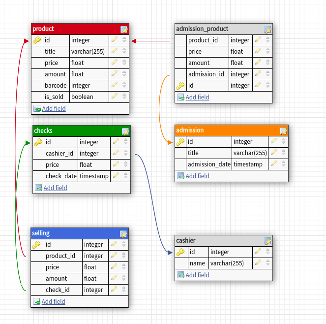

1. Описание предметной области

Приложение предназначено для управления товарами на складе. 
Среди доступных возможностей такие, как прием товара на склад, изменение цены и количества
товара, а также его удаление. Также реализован необходимый функционал для продажи товара и получения
статистики по продажам. 

2. В данном приложении реализована следующая структура базы данных 

2.1 Первая НФ. 

Как видно из изображения, каждая таблица не содержит повторяющихся данных,
также не существует полей, которые бы содержали более одного значения. Удовлетворение данным трем
правилам приводят данную структуру базы данных к 1 НФ

2.2. Вторая НФ. 

База данных приведена к 1 НФ. Каждая таблица имеет свой первичный ключ, при этом каждый атрибут 
каждой таблицы зависит целиком от этого ключа. Соблюдение данных двух условий делают текущую базу данных 
приведенной ко 2 НФ.

2.3. Третья НФ. 

База данных приведена к 3 НФ. Каждый атрибут зависит только от первичного ключа, но не от 
других атрибутов. Это делает данную базу приведенной к 3 НФ.

3. Некоторые комментарии к бд.

Может показаться, что некоторые атрибуты в базе данных повторяются
в разных таблицах, так как имеют одинаковые названия. Однако, это не так, данные атрибуты хранят в себе
абсолютно разные значения. Например, атрибут amount в таблице product хранит в себе актуальное 
значение количества конкретного продукта на складе. В то же время, атрибут amount в таблице admission_product 
хранит в себе значение количества определенного продукта в конкретной поставке. 